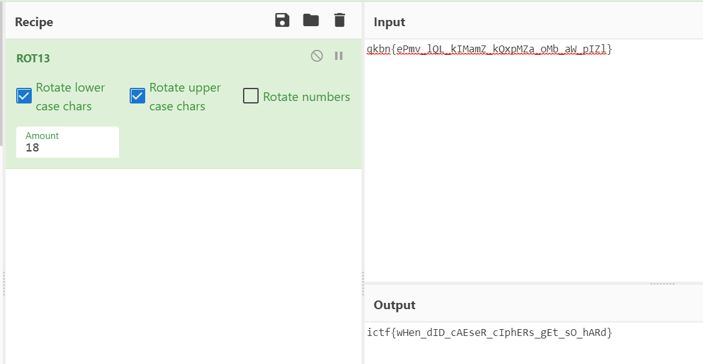

# Chicken Caesar Salad

## Challenge Description
`I remember the good old days when Caesar ciphers were easy…`

## Solution
The description of the challenge hinted that this is a caesar cipher challenge.

Using cyberchef:

    <kbd></kbd> 

CyberChef Link: https://gchq.github.io/CyberChef/#recipe=ROT13(true,true,false,18)&input=cWtibntlUG12X2xRTF9rSU1hbVpfa1F4cE1aYV9vTWJfYVdfcElabH0

Flag: `ictf{wHen_dID_cAEseR_cIphERs_gEt_sO_hARd}`