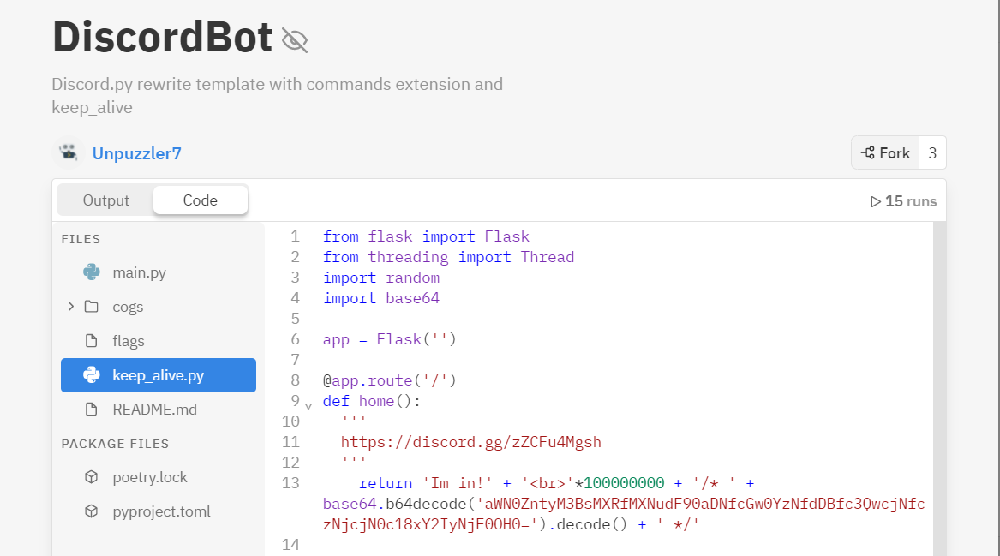
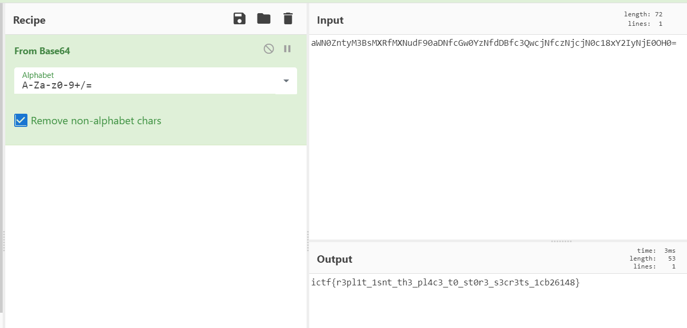

# Unpuzzled 2

## Challenge Description
`Puzzler7's evil twin is hiding one more secret. Find it for us. (Note: the flag for this challenge ends with 6148}.)`

## Solution
> TLDR: Unpuzzle7 has a `Repl.it` account. Found a base64 encoded string in one of his program and use cyberchef to decode it.

Using [sherlock](https://github.com/sherlock-project/sherlock):
``` bash
$ python3 sherlock.py unpuzzler7                                        
[*] Checking username unpuzzler7 on:
[+] ICQ: https://icq.im/unpuzzler7
[+] Quora: https://www.quora.com/profile/unpuzzler7
[+] Repl.it: https://repl.it/@unpuzzler7
```

His account has a `DiscordBot` program. In the source code, I found a base64 encoded string: `aWN0ZntyM3BsMXRfMXNudF90aDNfcGw0YzNfdDBfc3QwcjNfczNjcjN0c18xY2IyNjE0OH0=`

<p align="center">
    <kbd></kbd><br/>
</p>

Use cyberchef to decode the encoded string:
<p align="center">
    <kbd></kbd><br/>
</p>

Cyberchef link: https://gchq.github.io/CyberChef/#recipe=From_Base64('A-Za-z0-9%2B/%3D',true)&input=YVdOMFpudHlNM0JzTVhSZk1YTnVkRjkwYUROZmNHdzBZek5mZERCZmMzUXdjak5mY3pOamNqTjBjMTh4WTJJeU5qRTBPSDA9

Flag: `ictf{r3pl1t_1snt_th3_pl4c3_t0_st0r3_s3cr3ts_1cb26148}`
