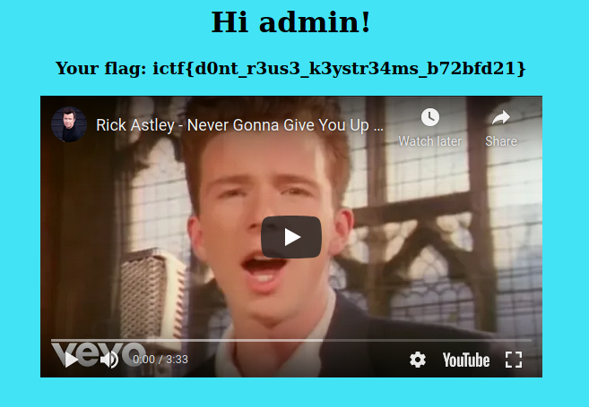

# Cookie Stream

## Challenge Description
`Cookie streaming service? Naaaaaaah. Password protected Rickroll as a Service? YAAAAAAAAAAAAAAAAAAAAAAAAAAAASSSSSSSSSSS!`

## Solution
> TDLR: Figure out the keystream, encrypt "admin" username and use it as cookie. 

Source code:
``` python
from flask import Flask, render_template, request, make_response, redirect
from Crypto.Cipher import AES
from Crypto.Util.Padding import pad, unpad
from binascii import hexlify, unhexlify
from os import urandom
from random import randint
from hashlib import sha512

app = Flask(__name__)

key = urandom(16)
cnonce = urandom(8)

users = {
    'admin' : '240964a7a2f1b057b898ef33c187f2c2412aa4d849ac1a920774fd317000d33ebb8b0064834ed1f8a74763df4e95cd8c8be3a154b46929c3969ce323db69b81f',
    'ImaginaryCTFUser' : '87197acc4657e9adcc2e4e24c77268fa5b95dea2867eacd493a0478a0c493420bfb2280c7e4e579a604e0a243f74a36a8931edf71b088add09537e54b11ce326',
    'Eth007' : '444c67bb7d9d56580e0a2fd1ad00c535e465fc3ca9558e8333512fe65ff971a3dfb6b08f48ea4f91f8e8b55887ec3f0d7634a8df98e636a4134628c95a8f0ebf',
    'just_a_normal_user' : 'b109f3bbbc244eb82441917ed06d618b9008dd09b3befd1b5e07394c706a8bb980b1d7785e5976ec049b46df5f1326af5a2ea6d103fd07c95385ffab0cacbc86',
    'firepwny' : '6adee5baa5ad468ac371d40771cf2e83e3033f91076f158d2c8d5d7be299adfce15247067740edd428ef596006d6eaa843b36cc109618e0a1cae843b6eed5c29',
    ':roocursion:' : '7f5310d2675c09c1b274f7642bf4979b2ce642515551a7617d155033e77ecfd53dede33ee541adde2f1072739696d0138d1b2f90c9ecc596095fa43b759e9baa',
}

def check(username, password):
    if username not in users.keys():
        return False
    if sha512(password.encode()).hexdigest() == users[username]:
        return True

@app.route('/')
def index():
    return render_template('login.html')

@app.route('/backend', methods=['GET', 'POST'])
def backend():
    if request.method == 'POST':
        if not check(request.form['username'], request.form['password']):
            return 'Wrong username/password.'
        resp = make_response(redirect('/home'))
        nonce = urandom(8)
        cipher = AES.new(key, AES.MODE_CTR, nonce=nonce) # my friend told me that cbc had some weird bit flipping attack? ctr sounds way cooler anyways
        cookie = hexlify(nonce + cipher.encrypt(pad(request.form['username'].encode(), 16)))
        resp.set_cookie('auth', cookie)
        return resp
    else:
        return make_response(redirect('/home'))

@app.route('/home', methods=['GET'])
def home():
    nonce = unhexlify(request.cookies.get('auth')[:16])
    cipher = AES.new(key, AES.MODE_CTR, nonce=nonce)
    username = unpad(cipher.decrypt(unhexlify(request.cookies.get('auth')[16:])), 16).decode()
    if username == 'admin':
        flag = open('flag.txt').read()
        return render_template('fun.html', username=username, message=f'Your flag: {flag}')
    else:
        return render_template('fun.html', username=username, message='Only the admin user can view the flag.')

@app.errorhandler(Exception)
def handle_error(e):
    return redirect('/')
```

Using crackstation, I managed to obtain credentials for the following users:
- ImaginaryCTFUser:idk
- Eth007:supersecure
- just_a_normal_user:password
- firepwny:pwned

From the source code, the program is using AES-CTR to encrypt the cookie. For AES-CTR to be cryptographically secure, the counter cannot be repeated. However, in this case, the counter is repeated.

### Background regarding AES-CTR
Ciphertext = Keystream XOR plaintext <br />
Ciphertext XOR plaintext = keystream <br />
Ciphertext XOR keystream = plaintext <br />

### Explanation
Since the keystream is constant, I can obtain the keystream and use it to encrypt the plaintext.

Notice that the program runs `pad(request.form['username'].encode(), 16))`. It pads the plaintext before encrypting.

I use python interpreter to figure out the padded plaintext
``` bash
>>> pad("admin".encode(), 16)
b'admin\x0b\x0b\x0b\x0b\x0b\x0b\x0b\x0b\x0b\x0b\x0b'
>>> pad("Eth007".encode(), 16)
b'Eth007\n\n\n\n\n\n\n\n\n\n'
```

Working POC:
``` python
from binascii import hexlify, unhexlify

username = "admin\x0b\x0b\x0b\x0b\x0b\x0b\x0b\x0b\x0b\x0b\x0b"
known_plaintext = "Eth007\n\n\n\n\n\n\n\n\n\n"
nonce = "73e0e77d52a54d78" # first 16 characters of the encrypted text is nonce
known_cipher = unhexlify("35fabf3b93f56c13e9d9346c5e57d1e6") # remaining characters are the encrypted username

#Encryption and decryption are symmetric operations; encrypting a ciphertext will reveal its value
def encrypt(key, plaintext):
    ret = bytearray()
    for i in range(0, len(plaintext)):
        ret.append(key[i%len(key)] ^ ord(plaintext[i]))
    return ret

#Calculate the key-stream from the known cipher and the known plaintext
key = bytearray()
for i in range(0, 16):
    key.append(known_cipher[i] ^ ord(known_plaintext[i]))

print("Keystream: " + hexlify(key).decode())
print("Nonce    : " + nonce)

#Verify the encryption remains the same for the known_plaintext
print("Original : " + nonce + hexlify(encrypt(key, known_plaintext)).decode())
#Print actual encrypted text
print("Edited   : " + nonce + hexlify(encrypt(key, username)).decode())
```
<p align="center">
    <kbd></kbd><br/>
</p>

Flag: `ictf{d0nt_r3us3_k3ystr34ms_b72bfd21}`


