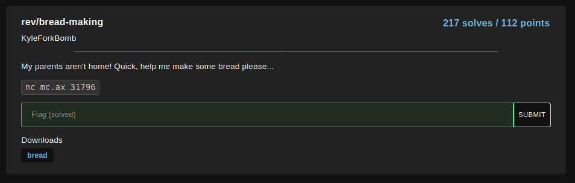
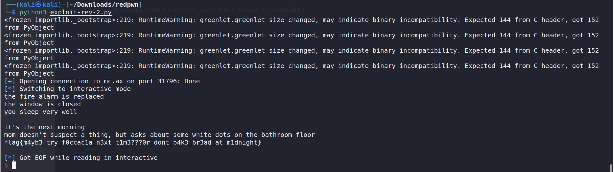

# bread-making

<p align="center">
    <kbd></kbd><br/>
</p>

The `strings` commands shows a list of potential inputs.

```
$ strings bread
[snip]
pull the tray out with a towel
there's no time to waste
pull the tray out
the window is closed
the fire alarm is replaced
you sleep very well
time to go to sleep
close the window
replace the fire alarm
brush teeth and go to bed
[snip]
```

Brute force with the list of inputs and observe its response. This can be done with a script:

```
from pwn import *

lines = []
with open('input') as f:
    lines = f.read().splitlines()
for i in range(0, 76, 1):
    p = process('./bread')
    p.recvuntil('add ingredients')
    
    
    print("Input: " + lines[i])
    p.sendline(lines[i])
    res = p.recv()
    print(res)
    print()
```

Repeat the brute force process until the program outputs the following line: `mom doesn't suspect a thing, but asks about some white dots on the bathroom floor`


The final script:
```
from pwn import *


p = remote('mc.ax', 31796)
p.recvuntil('add ingredients')
p.sendline('add flour')
p.recvuntil('flour')
p.sendline('add yeast')
p.recvuntil('yeast')
p.sendline('add salt')
p.recvuntil('salt')
p.sendline('add water')
p.recvuntil('water')
p.recvuntil('lumpy dough\n')
p.sendline('hide the bowl inside a box')
p.recvuntil('needs to rise\n')
p.sendline('wait 3 hours')
p.recvuntil('finish the dough\n')
p.sendline('work in the basement')
p.recvuntil('the dough is done, and needs to be baked\n')
p.sendline('preheat the toaster oven')
p.recvuntil('bakes for 45 minutes\n')
p.sendline('set a timer on your phone')
p.recvuntil('45 minutes is an awfully long time\n')
p.sendline('watch the bread bake')
p.recvuntil('no time to waste\n')
p.sendline('pull the tray out with a towel')
p.recvuntil('smoke in the air\n')
p.sendline('unplug the fire alarm')
p.sendline('open the window')
p.sendline('unplug the oven')
p.sendline('wash the sink')
p.sendline('flush the bread down the toilet')
p.sendline('clean the counters')
p.recvuntil('counters are cleaned\n')

p.sendline('get ready to sleep')
p.recvuntil('time to go to sleep\n')

p.sendline('replace the fire alarm')
p.sendline('close the window')
p.sendline('brush teeth and go to bed')
p.interactive()
```

<p align="center">
    <kbd></kbd><br/>
</p>

Flag: `flag{m4yb3_try_f0ccac1a_n3xt_t1m3???0r_dont_b4k3_br3ad_at_m1dnight}`