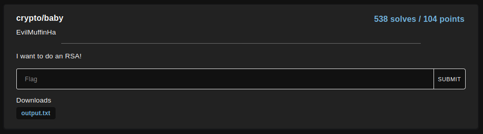
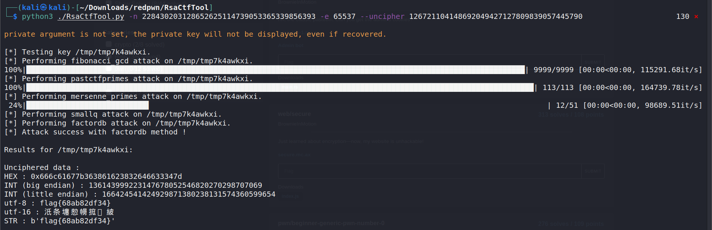

# baby

<p align="center">
    <br/>
</p>

The challenge provides the following text file:

```
$ cat output.txt 
n: 228430203128652625114739053365339856393
e: 65537
c: 126721104148692049427127809839057445790
```

Use [rsactftool](https://github.com/Ganapati/RsaCtfTool.git) to decrypt the ciphertext 

`$ python3 ./RsaCtfTool.py -n 228430203128652625114739053365339856393 -e 65537 --uncipher 126721104148692049427127809839057445790`

<p align="center">
    <br/>
</p>

Flag: `flag{68ab82df34}`