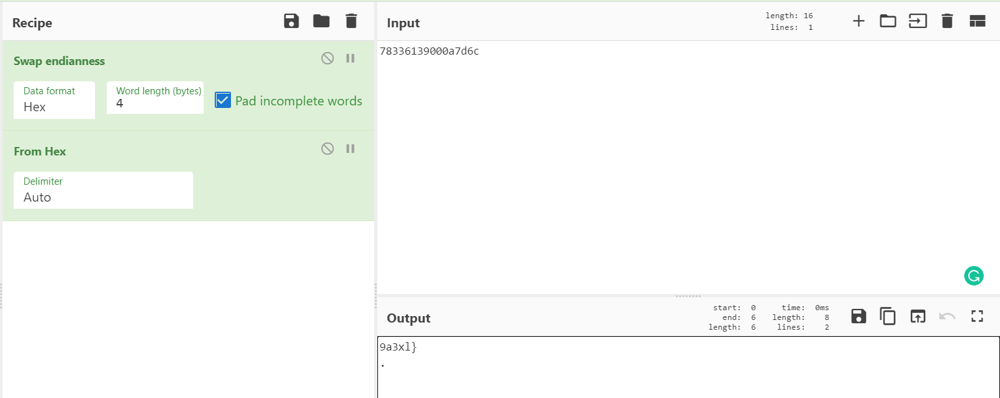

# printf-please

    <kbd></kbd> 

The challenge provides source code of the program. At line 31, it shows that the program is vulnerable to format string attack. Note: the program verify the first 6 bytes of the payload. So, the payload needs to start with “please”

    <kbd></kbd> 

I tried %x (See "Further information") and %s to dump the content of the flag (which is stored on the stack), but it fails. It returns segfault or incomplete flag. Luckily, %p works in this case.

Provide the following payload:
`please %p%p%p%p%p%p%p%p%p%p%p%p%p%p%p%p%p%p%p%p%p%p%p%p%p%p%p%p%p%p%p%p%p%p%p%p%p%p%p%p%p%p%p%p%p%p%p%p%p%p%p%p%p%p%p%p%p%p%p%p%p%p%p%p%p%p%p%p%p %p %p %p %p %p %p %p`

    <kbd></kbd> 

Place the last 8 bits to the front,  E.g. the first 16 bits will become 67616c66336c707b. As the address is in little endian, convert it back and convert it to ascii. Repeat the same process for the next 4 16-bits address:

    <kbd></kbd> 

For the last address, it is not 16 bits. So, prepend 0 to the address and then place the last 8 bits to the front, convert the endianess back and convert it to ascii.

    <kbd></kbd> 

Flag: `flag{pl3as3_pr1ntf_w1th_caut10n_9a3xl}`

# Further information
In order to dump the full flag, I need to use `%llx` instead of `%x`