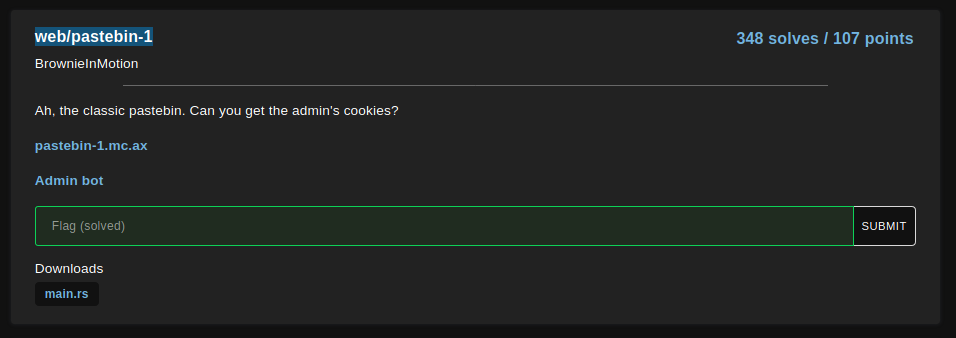
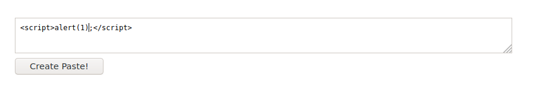
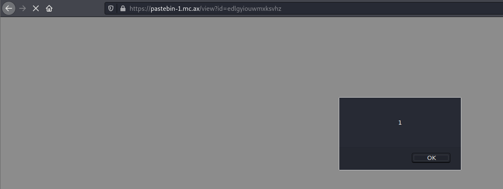
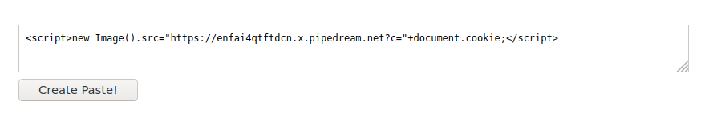
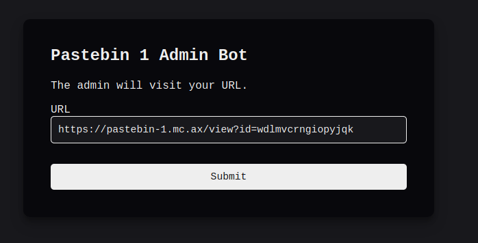
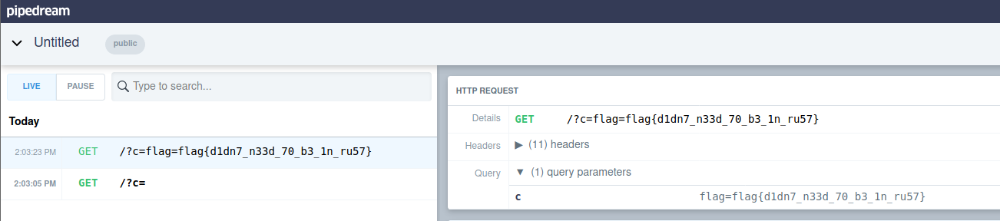

# pastebin-1

     

Notice that the website is vulnerable to XSS

     

     

Use [requestbin](https://requestbin.com/) to receive web response.

Exploit XSS vulnerability to obtain admin cookie

``

     

Use the admin page to access the vulnerable page.

     

Got the flag on requestbin

     

Flag: `flag{d1dn7_n33d_70_b3_1n_ru57}`